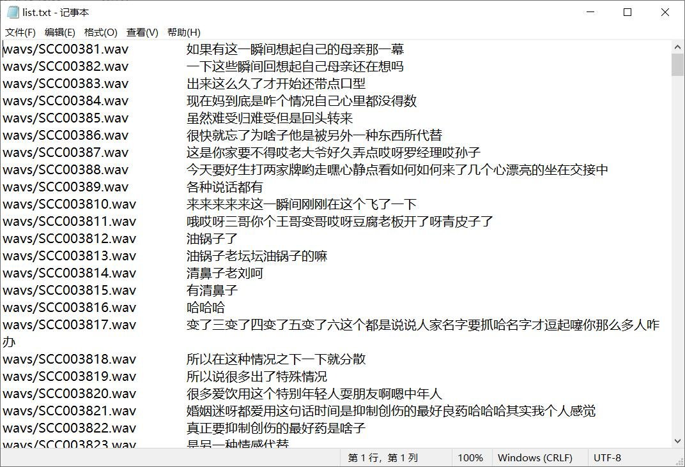
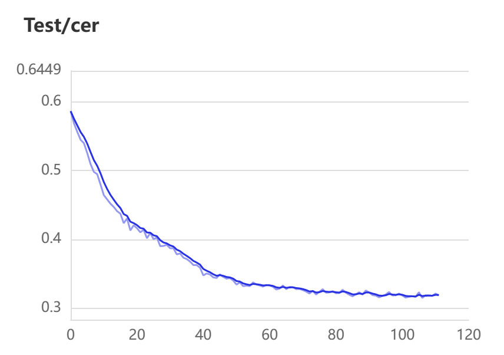

# 四川方言语音数据集

> sc_dataset2.zip

总时长50小时，数据来自于b站李伯清说书视频，有一些杂音。

后十一个文件夹有3000多条，其余的有300多条。

标注txt文件：

> 来自magic data 网站的6.4小时开源四川数据集sichuan.zip

本人小菜鸡采集数据用于本科毕设，十分感谢[yeyupiaoling (夜雨飘零) (github.com)](https://github.com/yeyupiaoling)作者大大，使用作者大大的MASR项目代码，最后通过conformer训练的cer如下：

# 下载
